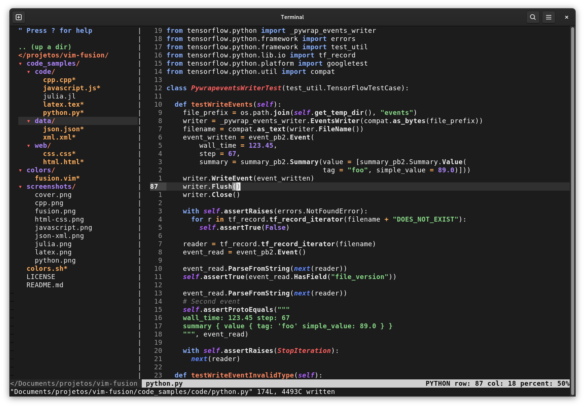
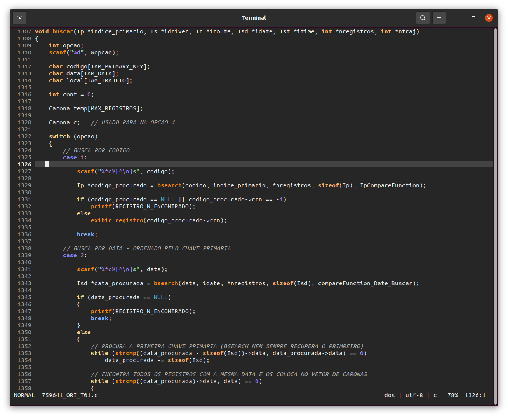
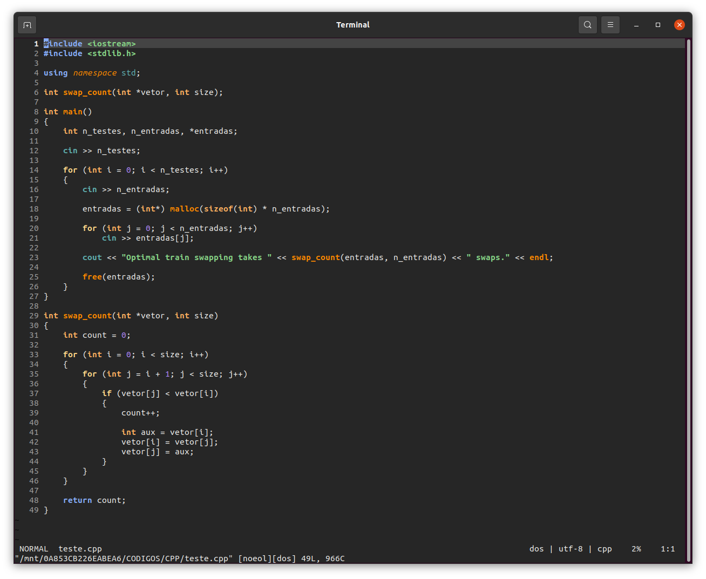
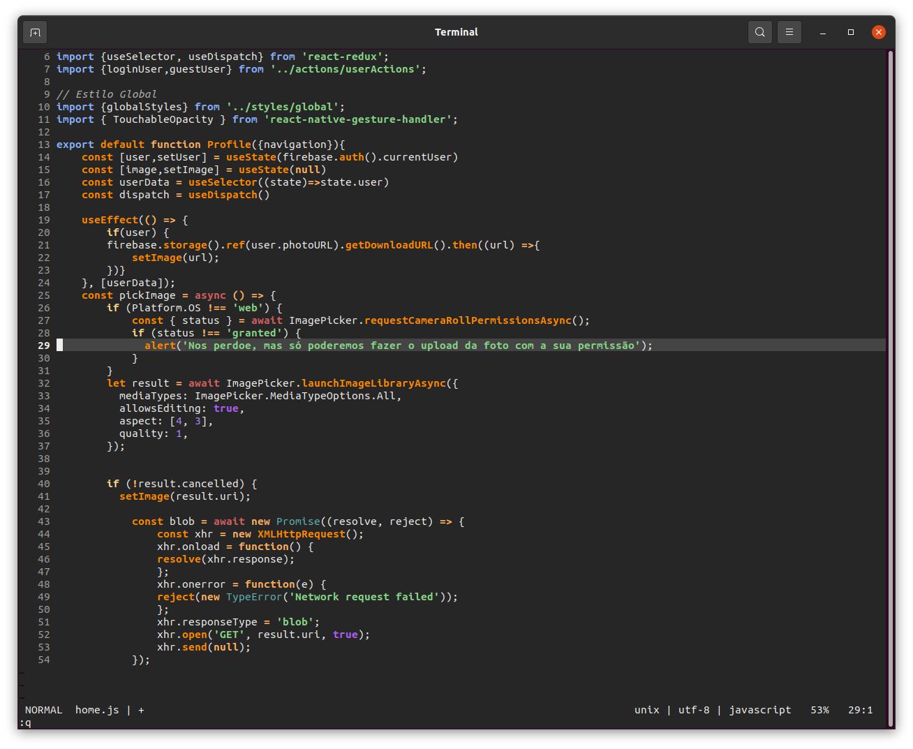
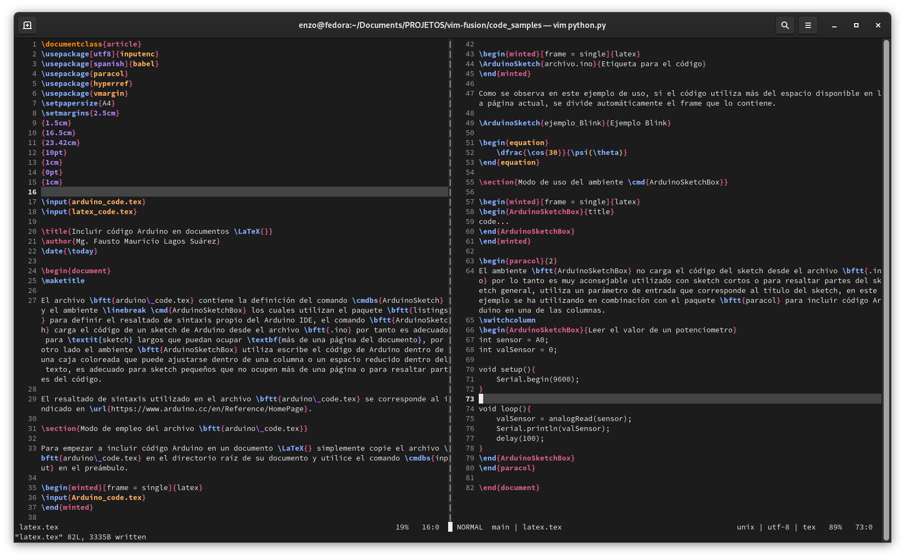

# Vim Fusion

Fusion colorscheme for Vim/NeoVim

## Installation

For both methods described bellow add the following line to your `.vimrc`

```console
colorscheme fusion
```

### Manual Installation

Clone the repo to `~/.vim/colors` directory (if it doesn't exist: `mkdir ~/.vim/colors`)

### vim-plug

```console
Plug 'lfenzo/vim-fusion'
```

## Screenshots

### Python


### C


### C++


### Javascript


### LaTeX

