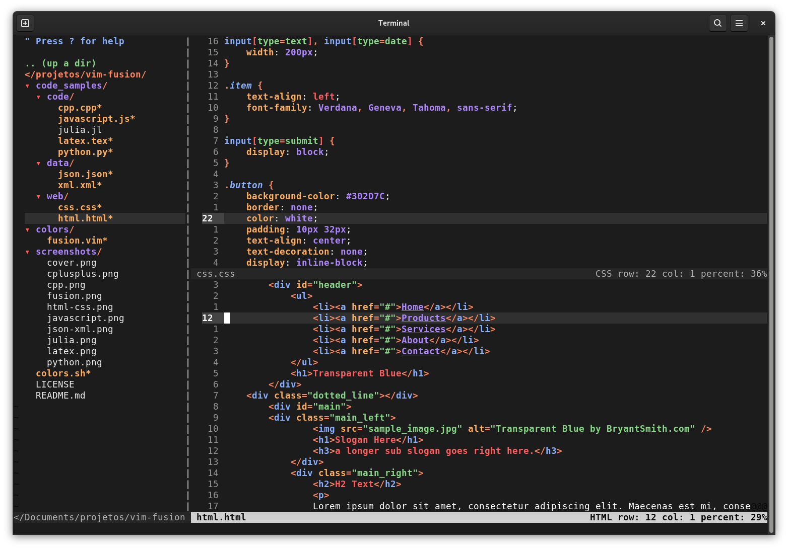
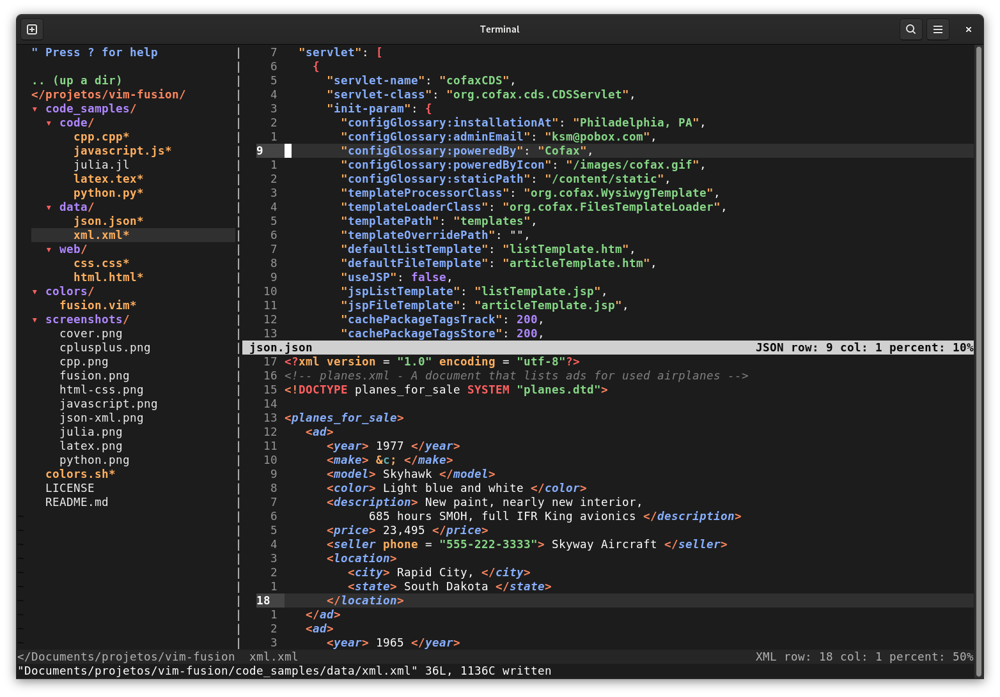

A neutral colorscheme for Vim/NeoVim. Vim Fusion works optimally with [vim-polyglot](https://github.com/sheerun/vim-polyglot) thanks to some of its syntax highlighting definitions; the installation of this plugin is not mandatory but keep in mind that some of the highlightings may not work exactly as shown when it is not installed. 

## Installation

For any of the methods described below add the following line to your `.vimrc`

```console
colorscheme fusion
```
### Manual Installation

Clone the repo and add the file `fusion.vim` to the `colors` directory inside `.vim`. In case you don't have it: `mkdir ~/.vim/colors`

### Using vim-plug

Inside the ``call plug#begin( ) ... plug#end`` add the following:

```console
Plug 'lfenzo/vim-fusion'
```
And then, `:w`, `:source %` and `:PlugInstall`.

## Screenshots

### Python


### C++


### Javascript 


### LaTeX


### HTML & CSS


### JSON & XML

