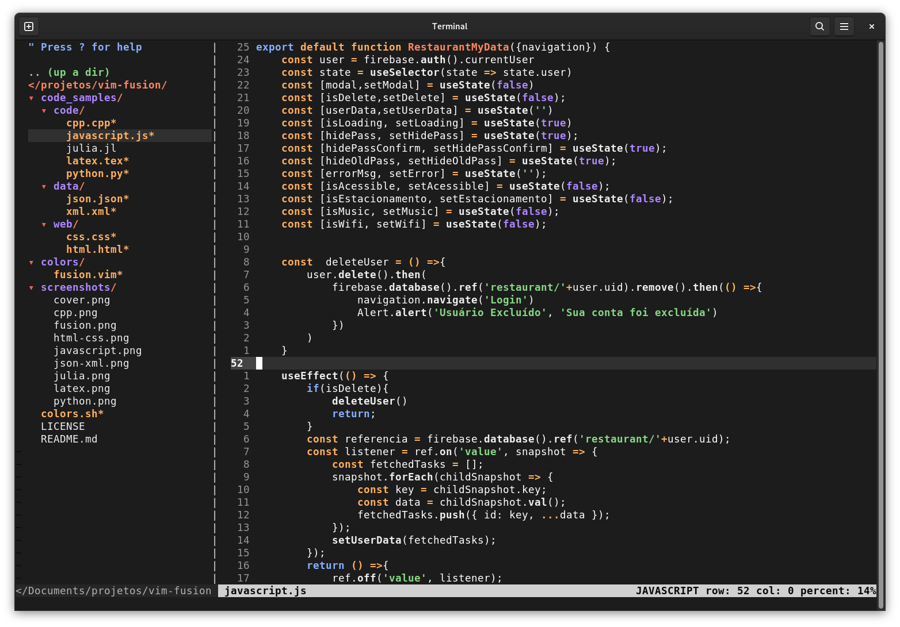

# Vim Fusion

A neutral colorscheme for Vim/NeoVim.

## Installation

For any of the methods described bellow add the following line to your `.vimrc`

```console
colorscheme fusion
```
### Manual Installation

Clone the repo and add the file `fusion.vim` to the `colors` directory inside `.vim`. In case you don't have it: `mkdir ~/.vim/colors`

### Using vim-plug

Inside the ``call plug#begin( ) ... plug#end`` add the following:

```console
Plug 'lfenzo/vim-fusion'
```
And then, `:w`, `:source %` and `:PlugInstall`.

## Screenshots

### Python


### C


### C++


### Javascript


### LaTeX


### HTML

